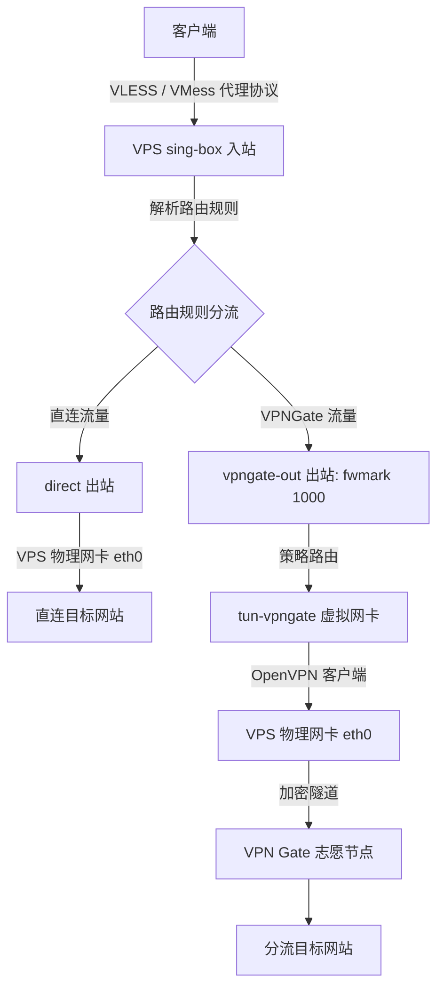

# sb-vpngate

基于 **sing-box 代理入站**与 **VPN Gate / 直连策略路由出站分流** 的一键部署与管理脚本。本脚本专为 Linux VPS 优化，完全采用 **纯 Bash / Shell 脚本实现（无 Python 依赖）**，设计优雅、防断连且高度自包含。

---

## 架构设计与网络拓扑



### 策略路由工作原理
1. **防止网关劫持 (No SSH Disconnect)**：OpenVPN 启动时带有 `route-nopull`，只在系统内注册 `tun-vpngate` 接口，不覆盖 VPS 本身的默认网关。这确保了 SSH 终端和入站连接永远不会断开。
2. **策略标记 (Policy Routing)**：sing-box 出站绑定 `routing_mark: 1000`；Linux 内核检测到 `fwmark 1000` (0x3e8) 的数据包，会强制查询策略路由表 `1000`，由 `tun-vpngate` 接口流出。
3. **源地址伪装 (MASQUERADE)**：挂载 iptables 规则，对流经 `tun-vpngate` 的数据包执行 NAT 转换，保证数据包能正确返回。

---

## 功能特性

* **纯 Bash 实现**：移除所有 Python 依赖，仅使用 `curl`, `awk`, `sort`, `base64` 等标准 Linux 命令行工具，极高运行效率与兼容性。
* **高自包含单文件**：主脚本 [sb-vpngate.sh](file:///d:/workspace/sb-vpngate/sb-vpngate.sh) 内嵌了所有的路由挂载脚本和 sing-box 配置模板。运行安装依赖时会自动释放和挂载相应资源，下载单文件即可部署整套系统。
* **双重协议入站**：支持主流的高抗封锁 **VLESS-Reality (XTLS-Vision)** 和支持 CDN 优选的 **VMess-WS**。
* **实时节点筛选与测速**：自动抓取 VPN Gate 节点，以系统评分降序或延迟进行排序，显示格式化终端表格供用户交互式挑选。
* **多种出站路由模式**：
  * **全局代理模式**：除中国大陆流量直连外，其余所有上网流量全部走 VPN Gate 出站（适合隐藏 VPS IP 或流媒体解锁）。
  * **规则分流模式**：默认 VPS 直连，仅境外主流被墙服务或指定流媒体（Google, Netflix, Disney+, Telegram）走 VPN Gate。

---

## 部署与安装步骤

### 方式 1：使用一键快捷命令在线运行 (推荐)
```bash
bash <(curl -Ls https://raw.githubusercontent.com/hxzlplp7/sb-vpngate/main/sb-vpngate.sh)
```

### 方式 2：手动下载并运行
请将 [sb-vpngate.sh](file:///d:/workspace/sb-vpngate/sb-vpngate.sh) 上传到您的 **Linux VPS** 上（支持 Debian 11/12、Ubuntu 20.04/22.04、CentOS 7/8/9 等）。

```bash
# 1. 赋予执行权限
chmod +x sb-vpngate.sh

# 2. 运行一键管理脚本
./sb-vpngate.sh
```

### 交互菜单操作指南

运行脚本后，系统会展示如下控制台菜单：
1. **执行 选项 1**：安装所需系统依赖（`openvpn`, `jq`, `iptables` 等）并拉取安装最新版官方 `sing-box` 二进制内核。
2. **执行 选项 2**：配置 VLESS-Reality 和 VMess-WS 的端口及参数。程序会自动检查端口占用，生成 UUID、Reality 密钥对与配置，并通过 `jq` 进行 JSON 语法校验。
3. **执行 选项 3**：交互式更新并连接 VPN Gate。您可以输入国家简称（如 `JP` 过滤日本节点，或者回车查看全部），选择满意的节点序号后，脚本会自动拉起 OpenVPN 拨号建立隧道。
4. **执行 选项 5**：启动所有服务（sing-box 和 openvpn-vpngate 客户端）。
5. **执行 选项 7**：查看服务运行状态，并直接获取生成的 **VLESS/VMess 客户端订阅连接**，支持一键复制导入到 v2rayN, Shadowrocket 等软件。

---

## 连通性与分流验证

1. **验证策略路由正常 (未劫持默认路由)**：
   在 VPS 终端执行 `curl icanhazip.com`，返回的 IP 应该仍然是 **VPS 自身的公网 IP**，且 SSH 终端无任何卡顿。
2. **验证直连出站**：
   配置好客户端代理后，访问 `http://ip.sb`。由于未被分流规则命中，返回的应为 **VPS 公网 IP**。
3. **验证 VPN Gate 分流出站**：
   代理下访问 `https://www.google.com` 或 `https://www.netflix.com`。由于命中分流出站，在浏览器中查看访问 IP，应显示为 **VPN Gate 志愿节点的公网 IP**（例如日本或美国的 IP）。

---

## 文件结构说明

当主脚本运行安装后，会在您的系统里分发和配置以下文件路径：
* `/etc/sing-box/sb-vpngate.env` — 保存入站端口、UUID、私钥等环境变量，用于脚本二次启动时自动恢复配置。
* `/etc/sing-box/config.json` — 经校验通过的 sing-box 运行配置文件。
* `/etc/sing-box/sb-config.json.template` — sing-box 基础配置模板。
* `/etc/openvpn/vpngate.ovpn` — 当前正在使用的 VPN Gate 节点 OpenVPN 配置文件。
* `/etc/openvpn/vpngate-up.sh` — OpenVPN 隧道启动时自动调用的策略路由挂载脚本。
* `/etc/openvpn/vpngate-down.sh` — OpenVPN 隧道断开时自动调用的策略清理脚本。
* `/etc/systemd/system/sing-box.service` — sing-box systemd 守护进程。
* `/etc/systemd/system/openvpn-vpngate.service` — VPN Gate 客户端连接 systemd 守护进程。
