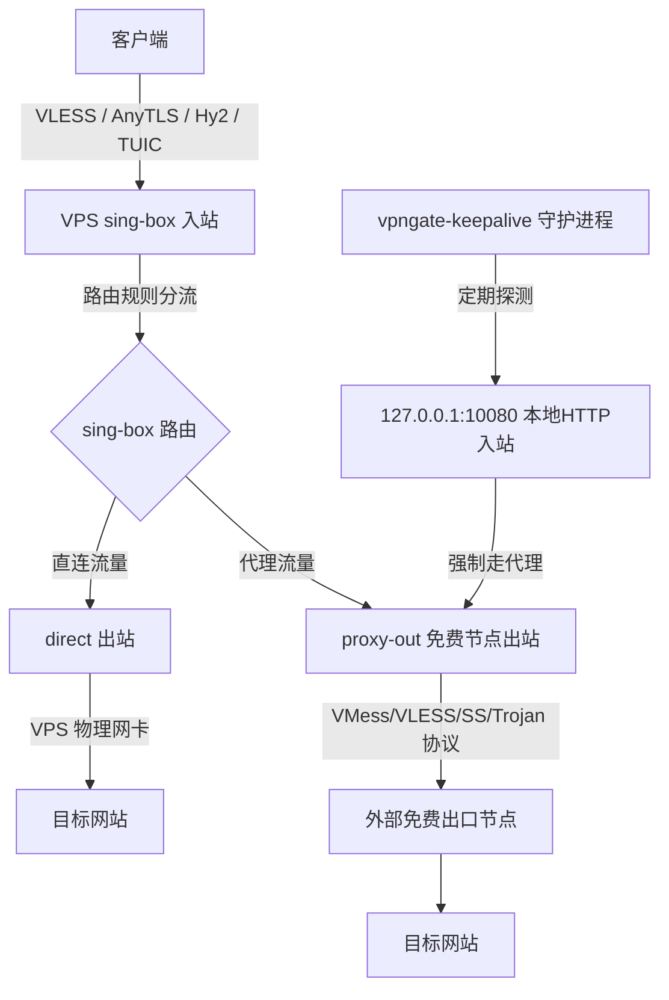

# sb-vpngate

基于 **sing-box 四合一代理入站** 与 **境外免费出口节点链式策略出站分流** 的一键部署与管理脚本。

本脚本专为 Linux VPS 优化，完全采用 **纯 Bash + 内联 Python 节点解析助手** 实现，设计优雅，零底层网络修改（无需虚拟网卡与系统路由表挂载），绝对防 SSH 断连，且具备掉线秒级自动漂移自愈能力。

---

## 🏗️ 架构设计与网络拓扑



### 链式分流工作原理
1. **四合一强力入站**：支持 **VLESS-Reality** (借用安全证书) / **AnyTLS** (新型 TLS 混淆) / **Hysteria 2** (强抗封锁 UDP) / **TUIC v5** (高性能 QUIC) 共存入站。
2. **免网卡零风险 (No SSH Disconnect)**：完全运行在应用层，无需创建 `tun` 网卡，不再修改 Linux 底层系统路由表与 iptables NAT 转发规则，彻底杜绝 VPS 发生 SSH 意外断开的隐患。
3. **本地监测入站 (`local-in`)**：sing-box 模板中内置一个监听在 `127.0.0.1:10080` 的 HTTP inbound，自愈重连守护进程定期通过该接口进行外网连通检测，判定当前外部节点是否可用。

---

## 💎 核心功能特性

* **四合一共存入站**：废弃了 VMess 节点，提供了最新的以安全和高性能为主导的 `VLESS-Reality`、`AnyTLS`、`Hysteria 2` 和 `TUIC v5` 四合一共存，并在选项 2 配置成功后**一键格式化输出所有协议的标准订阅分享链接**。
* **自签证书自动管理**：针对需要 TLS 的 AnyTLS, Hysteria 2, TUIC，脚本会自动使用 `openssl` 在本地生成 10 年期的自签证书，一键拉起服务。
* **结构化类型安全注入**：节点写入完全抛弃了不安全的 `sed` 文本宏替换，改用 `jq` 工具直接将选定的节点进行类型安全的、非转义式的强 JSON 合并，彻底规避了密码中包含特殊字符时导致的配置文件语法破损问题。
* **并发测速与升序排版**：从 6 个高可用非 Clash 订阅源中拉取去重后的数百个节点。通过 Python 端的 `ip-api/batch` 接口批量查询去重 IP 的地理归属；在 Bash 测速端**自动过滤删除所有不可用节点**，且仅将可用节点按照 **TCP 延迟从小到大（升序）** 重新进行排版展示与轮询连接。
* **掉线自动重连与漂移自愈**：启用断线守护后，守护服务会每 60 秒发起一次**基于 IPv4 正则匹配的真连通强校验**（防止代理返回 502/504 报错产生虚假连通）。一旦断网，会在秒级自动从延迟库里切换并连接到下一个最快的可用节点。
* **跨平台协作换行锁定**：项目配置了 `.gitattributes`，强行锁定脚本为 Unix 的 LF 换行格式，保证在任何平台协作克隆时都不会发生 `env: 'bash\r': No such file or directory` 错误。

---

## 📥 部署与安装步骤

### 方式 1：使用一键快捷命令在线运行 (推荐，挂载时间戳防缓存)
```bash
bash <(curl -Ls "https://raw.githubusercontent.com/hxzlplp7/sb-vpngate/main/sb-vpngate.sh?v=$(date +%s)")
```

### 方式 2：手动下载或 Git 克隆运行
```bash
git clone https://github.com/hxzlplp7/sb-vpngate.git
cd sb-vpngate
chmod +x sb-vpngate.sh
./sb-vpngate.sh
```

---

## ⚙️ 交互菜单操作指南

1. **选项 1：安装/更新 Sing-box 依赖及主内核**  
   安装系统所需的 `curl`, `python3`, `jq`, `openssl` 等基本依赖，拉取最新官方 sing-box 内核，并自动向系统注册 Systemd 进程。
2. **选项 2：配置并生成 Sing-box 入站配置 (VLESS-Reality / AnyTLS / Hysteria 2 / TUIC v5)**  
   输入您的代理域名和各个入站端口（或直接回车使用随机端口），脚本将生成证书并在终端上为您打印出所有 4 个协议的标准客户端分享链接，供您直接导入客户端软件（Nekobox, Shadowrocket, V2rayN 等）。
3. **选项 3：更新并连接免费节点 (从 6 个订阅源自动抓取/测速/过滤)**  
   输入国家简称（如 `JP` 过滤日本节点，或者直接回车展示所有国家节点）。脚本自动拉取订阅，对前 25 个节点进行高并发 TCP 延迟测速，**自动过滤并隐藏不可用节点，且按照延迟从小到大升序排序展示**。选择序号后自动重试轮询，直至基于 IP 强校验成功连通为止。
4. **选项 7：查看当前运行状态与配置连接信息**  
   查看 sing-box 进程和自愈守护服务运行状态。通过本地代理接口回显您当前真实的代理出口 IP 物理归属，并重新为您展示所有 4 个入站协议的详细端口、密钥及节点分享链接。
5. **选项 10：开启/关闭 节点掉线自动重连守护服务**  
   开启后，系统在后台每 60 秒轮询检测。一旦发现代理通道断开，便会自动拉起自愈漂移重连服务，零人工干预保证 7x24 小时翻墙不断线。

---

## 📂 文件结构说明

当主脚本运行安装后，会在您的系统里分发和配置以下文件路径：
* `/etc/sing-box/sb-vpngate.env` — 保存入站端口、UUID、密码、自愈国家条件等环境变量，用于脚本二次启动或重启时自动恢复配置。
* `/etc/sing-box/config.json` — 经校验通过的 sing-box 运行配置文件。
* `/etc/sing-box/sb-config.json.template` — sing-box 四合一配置模板。
* `/etc/sing-box/subscribe_parser.py` — Python 3 并发拉取和节点解析工具。
* `/etc/sing-box/nodes_cache.json` — 节点缓存文件。
* `/etc/sing-box/self_signed.crt` / `self_signed.key` — 自动生成的 10 年期自签证书。
* `/usr/local/bin/vpngate-keepalive.sh` — 自动掉线监控自愈脚本。
* `/etc/systemd/system/sing-box.service` — sing-box systemd 守护服务。
* `/etc/systemd/system/vpngate-keepalive.service` — 断线重连守护 systemd 监控服务。
